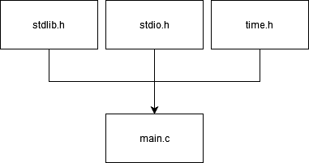
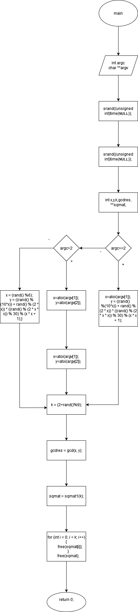
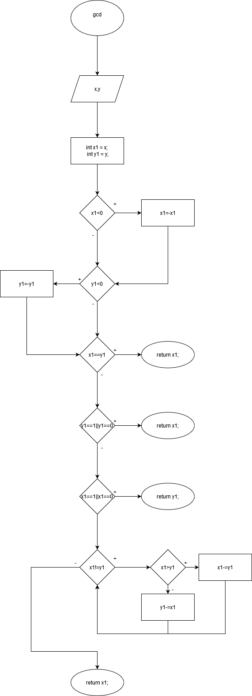
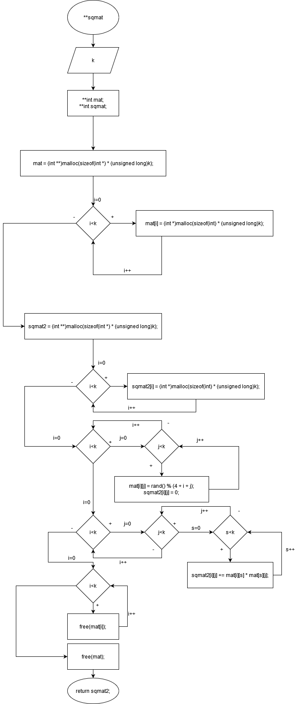
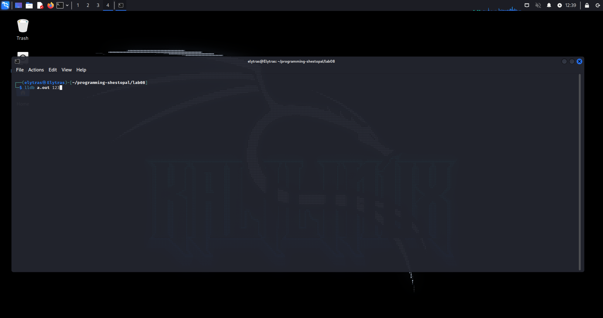
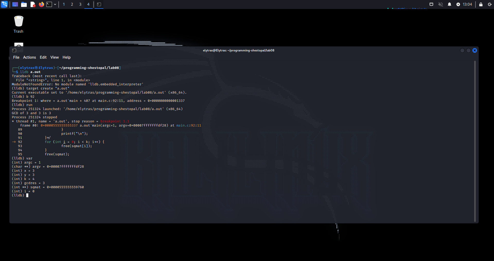
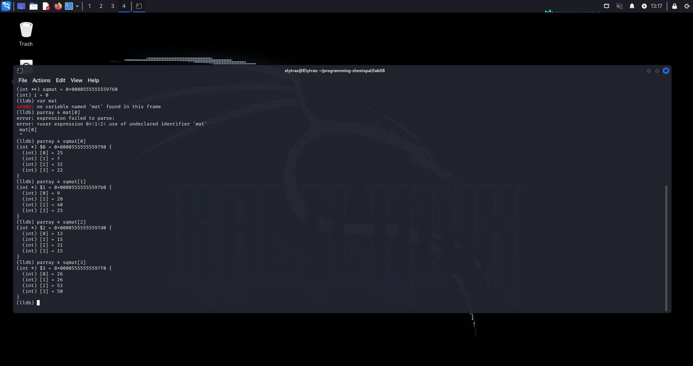

#Лабораторна робота No7. Функції

**Автор:** Шестопал Дмитро Олексійович

**Група:**КН-922Б

**Репозіторій проекту:**https://github.com/ElytrasHvH/programming-shestopal

#Завдання:

1.Переробити програми, що були розроблені під час виконання лабораторних робіт з тем "Масиви" та "Цикли" таким чином, щоб використовувалися функції для обчислення результату.

2.Функції повинні задовольняти основну їх причетність - уникати дублювання коду. Тому, для демонстрації роботи, ваша програма (функція main()) повинна мати можливість викликати розроблену функцію з різними вхідними даними.

3.Слід звернути увагу: параметри одного з викликів функції повинні бути згенеровані за допомогою генератора псевдовипадкових чисел random().

4.Слід звернути увагу (#2): продемонструвати встановлення вхідних даних через аргументи додатка (параметри командної строки). Обробити випадок, коли дані не передались - у цьому випадку вони матимуть значення за умовчуванням, обраними розробником.

##Опис програми

##Функціональне призначення

- Розрахунок квадрату матриці та пошук НСД
  
- При запуску программи треба написати 2 числа щоб знайти їх НСД

- Якщо тільки одне число буде записано, друге буде згенеровано само (за допомогою random())

- Якщо жодного числа не буде - програма згенерує два числа сама  
  
***Опис логічної структури***   


***Вміст файлу main.c***
Основний файл.

- Має точку входу

- Має виклики функцій **sqmat1, gcd

`main(int argc, char **argv)` - Точка входу, приймає аргументи з терміналу

1. argc - кількість аргументів

2. **argv - масив строк з аргументами

***Послідовність дій***

- Присвоїти значення argc, argv 
- Створення змінних
Змінні:
: x  Перше число для якого шукати НСД.  Генерується якщо не задано
: y  Друге число для якого шукати НСД.  Генерується якщо не задано
: k  Розмір матриці (генерується сам)
: gcdres  Приймає результат виконування функції gcd
: **sqmat   Приймає вказівник на результат функції sqmat1

Функція  
1. main

```
    if(argc==2) {
	x=atoi(argv[1]);
	y = ((rand() %(10*x)) + rand() % (2 * x)) * ((rand() % (2 * x * x)) % 30) % (x * x + 1);
	} 
	else if(argc>2) {
	x=atoi(argv[1]);
	y=atoi(argv[2]);	
	}
	else {
	x = (rand() %6);
	y = ((rand() % (10*x)) + rand() % (2 * x)) * ((rand() % (2 * x * x)) % 30) % (x * x + 1);
	} 
	 k = (2+rand()%9); 
    gcdres = gcd(x, y); 
    sqmat = sqmat1(k); 
```

 
2. gcd
:Приймає x та y та присвоює їх значення локальним змінним x1, y1  
Спочатку йде перевірка на тривіальні рішення з поверненням результату якщо така відповідь знайдена
```  
  if (x1 < 0) {
		x1 = -x1; //GCD for negative numbers is same as for positive, so inversing
	}
	if (y1 < 0) {
		y1 = -y1;
	}
	if (y1 == 0||y1==1||x1==y1) {
		return x1;
	}
	if (x1 == 0||x1==1) {
		return y1;
	}
```  
Далі йде пошук нетривіального рішення  
```  
  	while (x1 != y1) {
		if (x1 > y1) {
			x1 -= y1;
		} else {
			y1 -= x1;
		}
	}
    return x1;
```


3. sqmat  
:Приймає k який буде виступати у ролі розміру квадратної матриці  
Створює 2 змінні  

-`**mat  `

-`**sqmat2  `

Виділає пам'ять під массиви  
```  
    mat = (int **)malloc(sizeof(int *) * (unsigned long)k); //alloc memory for array of pointers to arrays (input) 
	for (int i = 0; i < k; i++) {
		mat[i] = (int *)malloc(sizeof(int) * (unsigned long)k); //alloc memory for arrays (input)
	}
	sqmat2 = (int **)malloc(sizeof(int *) * (unsigned long)k); //alloc memory for array of pointers to arrays (output)
	for (int i = 0; i < k; i++) {
		sqmat2[i] = (int *)malloc(sizeof(int) * (unsigned long)k); //alloc memory for arrays (output)
	}
``` 
Заповнює початковий массив, та вихідний массив  
```  
	for (int i = 0; i < k; i++) {
		for (int j = 0; j < k; j++) {
			mat[i][j] = rand() % (4 + i + j); //filling input matrix with random numbers
			sqmat2[i][j] = 0;
			//printf("%d\t", mat[i][j]);
		}
		//printf("\n");
	}
```
Після цього розраховую квадрат матриці  
```  
	for (int i = 0; i < k; i++) {
		for (int j = 0; j < k; j++) {
			for (int s = 0; s < k; s++) {
				sqmat2[i][j] += mat[i][s] * mat[s][j];
			}
		}
	}
  
```
Після чого очищає пам'ять зайняту першим массивом та повертає вказівник на массив-відповідь
```  
	for (int i = 0; i < k; i++) { 
		free(mat[i]);
	}
	free(mat);

	return sqmat2;  
```


##Використання
1. Встановивши попредньо lldb або інший дебагер, та скомпілювавши программу з флагом (для clang) -g  
запустити программу з або без аргументів



2. Встановити бреакпоінт на строці 92 
`b 92`
3. Перевірити змінні 
`var`

gcdres - НСД заданних нами/згенерованими програмою числами
k - розмір матриці.  
Щоб отримати квадрат згенерованої матриці треба написати
`parray "k" sqmat[x]`
де замість k треба написати значення k а x - значення від 0 до k-1 що будуть показувати значення у строках рівним x+1 (якщо переводити на язик математики) тобто   
`parray "a" sqmat[0]` покаже перші a значень у першій строці матриці (якщо a = k,покаже усю строку)
якщо треба дізнатися значення конкретного номеру можно використати var mat[a][b], де 0<=(a,b)<k


##Висновки У цій роботі було перетворено лабораторні проекти №5 та №6 для використання функцій. Було набуто навичок роботи з функціями, їх декларація, реалізація та виклик. Під час тестування програми були отримані результати функції gcd - Найбільший Спільний Дільник (Отримання аргументів через командну страку), і робота функції **sqmat1 - генерація матриці та розрахунок квадрату цієї матриці.